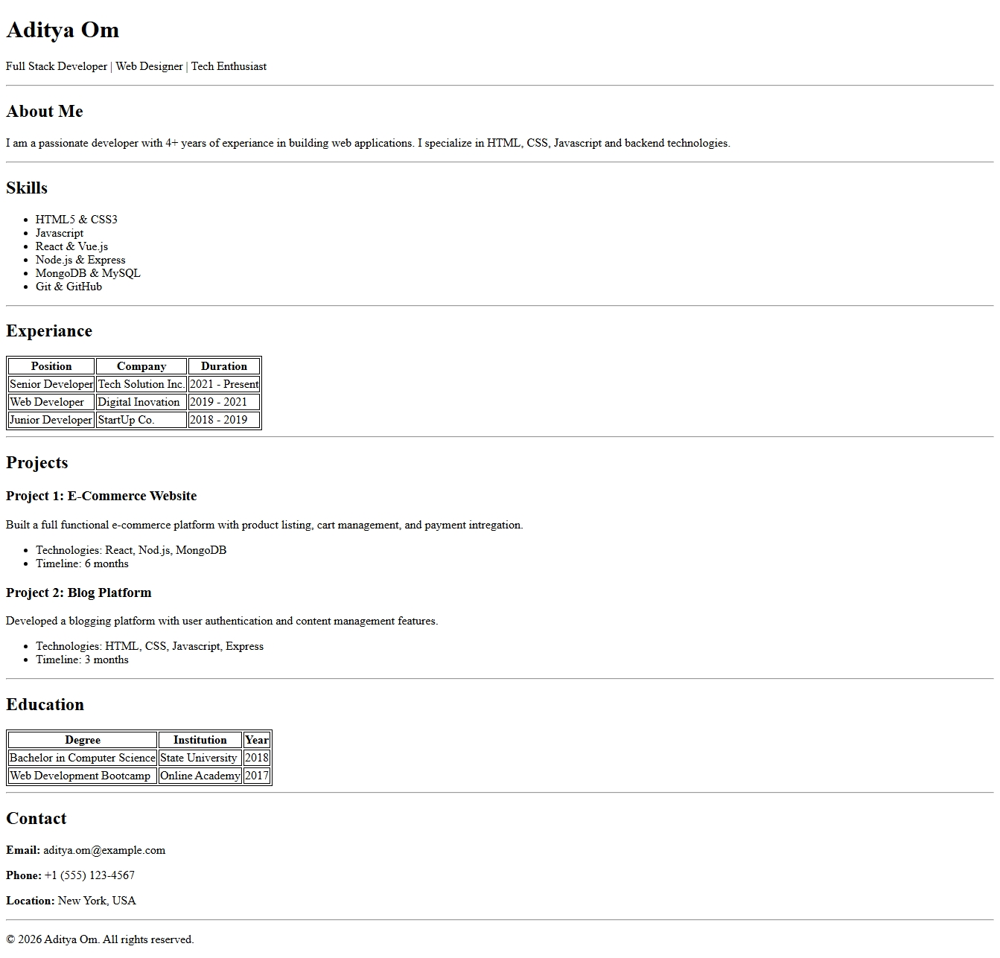

# HTML-Resume-Page

This is a resume page built using HTML only.

## Live Demo

[Website Link](https://adityacyber.github.io/HTML-Resume-Page/)

## Screenshot



## Tech Stack

- HTML

## Setup Instructions

### Clone the repository

```bash
git clone https://github.com/Adityacyber/HTML-Resume-Page.git
```

### Open project file

```bash
cd HTML-Resume-Page
```

## Run Project

open `intex.html` in browser

## Features

- Clean and Readable
- Only HTML

## Project Structure

```
HTML-Resume-Page/
    ├── index.html
    ├── screenshot.jpeg
```

## Author

Aditya Om
